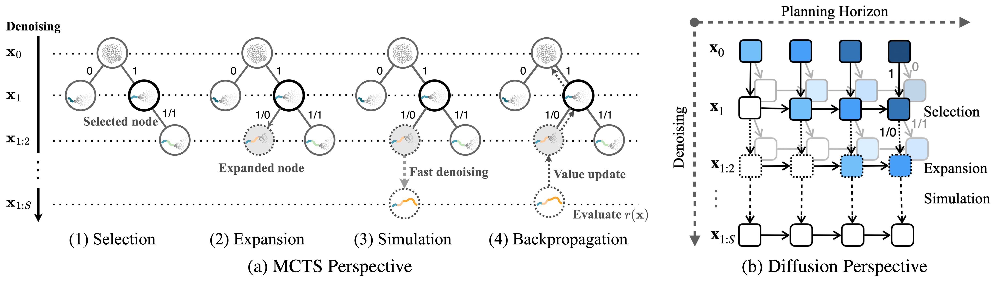
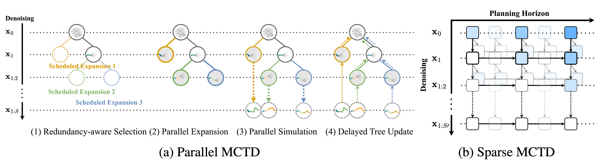

# Monte Carlo Tree Diffusion (MCTD)

This repository provides the **official PyTorch implementation** for Monte Carlo Tree Diffusion (MCTD) and Fast Monte Carlo Tree Diffusion (Fast-MCTD). Our work demonstrates how to leverage Monte Carlo Tree Search (MCTS) to guide diffusion models during inference, significantly improving planning performance in complex environments like the point and ant mazes.

## Monte Carlo Tree Diffusion (MCTD)

Author: Jaesik Yoon, Hyeonseo Cho, Doojin Baek, Yoshua Bengio, Sungjin Ahn

_Published in the proceedings of the International Conference on Machine Learning (ICML) 2025, Spotlight._

[[Paper]](https://arxiv.org/abs/2502.07202) [[Project Page]](https://jaesikyoon.com/mctd-page/)



Monte Carlo Tree Diffusion (MCTD) is a novel framework that improves the inference-time performance of diffusion models by integrating the denoising process with Monte Carlo Tree Search (MCTS).

## Fast Monte Carlo Tree Diffusion (Fast-MCTD)

Author: Jaesik Yoon*, Hyeonseo Cho*, Yoshua Bengio, Sungjin Ahn (* equal contribution)

_Preprint, 2025._

[[Paper]](https://arxiv.org/abs/2506.09498) [[Project Page]](https://jaesikyoon.com/fast-mctd-page/)



Fast Monte Carlo Tree Diffusion (Fast-MCTD) is an enhanced version of MCTD that improves computational efficiency through parallel tree search and abstract-level diffusion planning.

## Installation

We recommend using Docker to set up the environment for reproducibility.

**1. Download MuJoCo binaries:**
Our Docker setup requires the MuJoCo 2.1.0 binaries. Please download them from this [link](https://drive.google.com/drive/folders/1gwXsIzpTILXG6kZv1EDrLBeEKYpPAl-G?usp=drive_link) and place the `mujoco210` directory into `./dockerfile/mujoco/`. The final path should look like `./dockerfile/mujoco/mujoco210`.

**2. Build the Docker image:**

From the root of the repository, run the following command:

```bash
docker build -t fmctd:0.1 . -f dockerfile/Dockerfile
```

> **Note on the environment:** The Dockerfile installs a customized version of the [OGBench](https://seohong.me/projects/ogbench/) benchmark. This customization serves two purposes: it incorporates velocity into the maze environment's observation space and removes randomness from the start and goal positions to reduce performance variance.

**3. Log in to Weights & Biases:** This project uses Weights & Biases (W&B) for logging. **You will need to log in to your W&B account.**

```bash
wandb login
```

## Evaluation

### **1. Download Pre-trained Models**

Download the models from this [link](https://drive.google.com/drive/folders/1FoEkB83l1dNShupfKHmucchPJnbcLg3l?usp=share_link).

- `dql_trained_models.tar.gz`: Contains pre-trained models for DQL. Extract this to the `./dql/` directory.
    
- `planner_trained_models.tar.gz`: Contains pre-trained diffusion models. **This requires a specific directory structure to match our W&B logs.**
    
    - **First, create a directory path:** `mkdir -p ./output/downloaded/<YOUR_WANDB_ENTITY>/<YOUR_WANDB_PROJECT>`
        
        - Replace `<YOUR_WANDB_ENTITY>` with your W&B username or entity name.
            
        - Replace `<YOUR_WANDB_PROJECT>` with a project name of your choice (e.g., `mctd-eval`).
            
    - **Then, extract the archive into that directory.**
        

### **2. Configure and Create Evaluation Jobs**

Example scripts are provided to create evaluation experiments. You need to edit these files to match your W&B setup.

- Open `insert_point_maze_validation_jobs.py` and `insert_antmaze_validation_jobs.py`.
    
- **At the top of each file, set the `WANDB_ENTITY` and `WANDB_PROJECT_NAME` variables** to the same values you used in the step above.
    
- Run the scripts to add the jobs to the queue:
    
```bash
python insert_point_maze_validation_jobs.py
python insert_antmaze_validation_jobs.py
```

### **3. Run the Evaluation**

Execute the jobs using the `run_jobs.py` script.

- Open `run_jobs.py` and configure the `available_gpus` variable to specify which GPUs to use.
    
- Run the script:
    
```bash
python run_jobs.py
```

The script will automatically assign jobs to the available GPUs. To distribute jobs across multiple servers, run this script on each server with the appropriate `available_gpus` configuration.

### **4. Summarize Results**

After all evaluation jobs are complete, aggregate the results.

- Open `summarize_results.py` and set the `group_names` variable to match the experiment groups you want to analyze.
    
- Run the script:
    
```bash
python summarize_results.py
```

The results will be saved to the `exp_results` directory and printed to the terminal:

Bash

```bash
{'group': 'PMMN-PMCTD', 'success_rate': '100±0', 'planning_time': '11.11±2.13'}
{'group': 'PMLN-PMCTD', 'success_rate': '98±0', 'planning_time': '8.41±1.34'}
{'group': 'PMGN-PMCTD', 'success_rate': '98±0', 'planning_time': '9.68±0.51'}
{'group': 'PMMN-FMCTD', 'success_rate': '100±0', 'planning_time': '1.91±0.20'}
{'group': 'PMLN-FMCTD', 'success_rate': '82±0', 'planning_time': '2.06±0.08'}
{'group': 'PMGN-FMCTD', 'success_rate': '98±0', 'planning_time': '2.71±0.28'}
```

### Public W&B Logs

The full Weights & Biases logs for the experiments in our paper are publicly available at this [link](https://wandb.ai/jaesikyoon/jaesik_mctd). These logs correspond to the configurations in the example job creation scripts.


## Training

To train new models from scratch, follow a similar process:

**1. Configure and Create Training Jobs**

- Open `insert_diffusion_training_jobs.py` and `insert_dql_training_jobs.py`.
    
- **At the top of each file, set your desired `WANDB_ENTITY`, `WANDB_PROJECT_NAME`, and other training parameters.**
    
- Run the scripts to create the jobs:
    
```bash
python insert_diffusion_training_jobs.py
python insert_dql_training_jobs.py
```

**2. Run the Training**

- Configure `available_gpus` in `run_jobs.py`.
    
- Execute the script to start training:
    
```bash
python run_jobs.py
```

## References

If you find our work useful, please consider citing:

```bibtex
@inproceedings{yoonmonte,
  title={Monte Carlo Tree Diffusion for System 2 Planning},
  author={Yoon, Jaesik and Cho, Hyeonseo and Baek, Doojin and Bengio, Yoshua and Ahn, Sungjin},
  booktitle={Forty-second International Conference on Machine Learning}
}
```

```bibtex
@article{yoon2025fast,
  title={Fast Monte Carlo Tree Diffusion: 100x Speedup via Parallel Sparse Planning},
  author={Yoon, Jaesik and Cho, Hyeonseo and Bengio, Yoshua and Ahn, Sungjin},
  journal={arXiv preprint arXiv:2506.09498},
  year={2025}
}
```

## Acknowledgement
This repo is forked from [Boyuan Chen](https://boyuan.space/)'s research template [repo](https://github.com/buoyancy99/research-template), especially, it is based on Diffusion Forcing source code, [repo](https://github.com/buoyancy99/diffusion-forcing/tree/main). We thank the authors for making their code publicly available.
